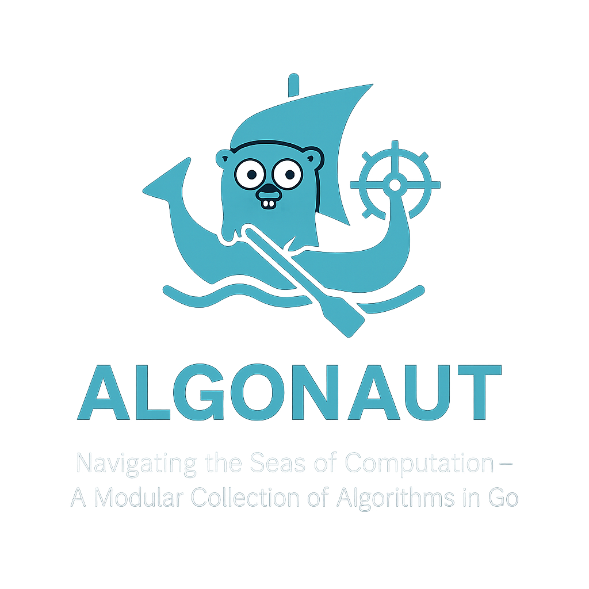

# Algonaut
**Navigating the Seas of Computation — A Modular Collection of Algorithms in Go**

Algonaut is a modular, idiomatic Go library that implements a growing collection of classic and modern algorithms. Inspired by the mythic Argonauts who ventured into the unknown, this project charts the deep waters of computation with engineering rigor.

## Logo

## Structure
Each algorithm lives in its own package.

